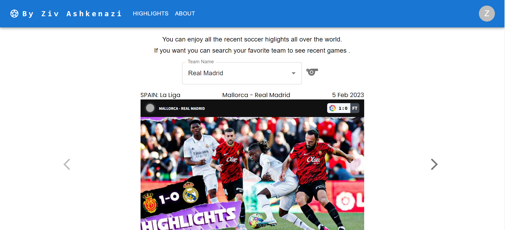

# Worldwide soccer highlights

## About The Project:
In my site you can watch daily soccer highlights from all over the world. <br/>
* you can search your favorite team and see their recent games highlights.

## Images



## Technologies I used:
* React.JS
* Rest API
* Javascript + CSS

## Getting Started

### Installing

git clone my reposetory to your local folder.

### Executing program

* open new terminal and run the following commands:
```
cd daily-soccer
npm install
npm start
```
## Authors

Ziv Ashkenazi 
[@Linkdin](https://www.linkedin.com/in/ziv-ashkenazi/)
